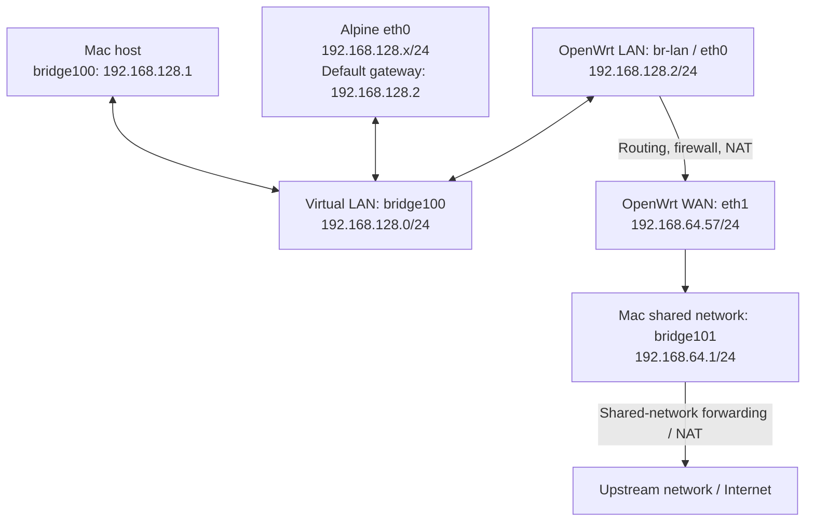

# How to Set Up and Test the Environment

## Test Environment

- Host: Apple Silicon Mac
- QEMU VM: Alpine Linux, acting as the LAN client
- QEMU VM: OpenWrt 24.10.4 initramfs, acting as the router



Mac and both VMs communicate directly on the LAN. Alpine reaches the Internet through OpenWrt.

Bridge names and subnets depend on the host. Check `ifconfig` before configuring the LAN. The WAN address is assigned by DHCP.

## Downloads

- [UTM for macOS](https://mac.getutm.app/)
- [Alpine Linux](https://www.alpinelinux.org/downloads/): **Virtual**, **aarch64** ISO
- [OpenWrt 24.10.4 initramfs kernel](https://downloads.openwrt.org/releases/24.10.4/targets/armsr/armv8/openwrt-24.10.4-armsr-armv8-generic-initramfs-kernel.bin)
- [Wireshark](https://www.wireshark.org/download.html)

Use the QEMU backend in UTM. Leave **Use Apple Virtualization** unchecked when creating the VMs.

## Create the VMs

### Alpine Linux

1. In UTM, select **Create → Virtualize → Linux**. Select the Alpine ISO.
2. Allocate 2 CPU cores, 1–2 GB RAM, and an 8 GB disk. Keep UEFI boot enabled and use a VirtIO disk.
3. Keep one **Shared Network** adapter for installation.
4. Boot the ISO. Log in as `root` with no password and run:

   ```sh
   setup-alpine
   ```

5. Select `eth0` with DHCP. Set a root password, select a package mirror, and choose `openssh` if SSH access is needed.
6. Select the VM disk, normally `vda`, and choose `sys` mode. Confirm installation to this new VM disk.
7. Shut down the VM:

   ```sh
   poweroff
   ```

8. Eject the ISO. Apply the test-network configuration below, then boot from disk.

See the [Alpine VM installation guide](https://wiki.alpinelinux.org/wiki/Installing_Alpine_in_a_virtual_machine) for installer details.

### OpenWrt

1. Create a QEMU VM through **Create → Virtualize → Other**, with no boot ISO.
2. Select ARM64 (`aarch64`), the `virt` machine, 2 CPU cores, and 1 GB RAM.
3. Disable **UEFI Boot** under **QEMU**. This VM boots the kernel directly.
4. Under **Drives → New**, import the downloaded `.bin` as **Linux Kernel**. Some UTM versions label this type **Deprecated Linux Kernel**. No root disk or separate initrd is needed.
5. Remove the unused blank disk and display device. Add a **Serial** device with **Built-in Terminal** and **Automatic** target.
6. Apply the network arguments below. Boot the VM and press Enter to open the root shell.

UTM maps the kernel image to QEMU's `-kernel` option. See [drive settings](https://docs.getutm.app/settings-qemu/drive/drive/) and [serial settings](https://docs.getutm.app/settings-qemu/devices/serial/).

## Environment Setup

### 1. Configure the Alpine Network

With the VM stopped, remove its installation network adapter. Under **QEMU → Arguments**, add:

```text
-netdev vmnet-host,id=net0,net-uuid=0C6A3A76-4F38-46F3-9B3F-D08E627065C6
-device virtio-net-pci,netdev=net0,mac=52:54:11:22:34:56
```

These are QEMU arguments. In UTM, add each option and its value as separate argument entries; do not paste the block into a shell. See [UTM QEMU arguments](https://docs.getutm.app/settings-qemu/qemu/#qemu-arguments).

### 2. Configure the OpenWrt Networks

Remove UTM's default network adapter. Add these arguments in LAN-first order:

```text
-netdev vmnet-host,id=lan,net-uuid=0C6A3A76-4F38-46F3-9B3F-D08E627065C6
-device virtio-net-pci,netdev=lan,mac=52:54:00:12:34:56

-netdev vmnet-shared,id=wan
-device virtio-net-pci,netdev=wan,mac=52:54:00:12:34:57
```

Use the same `net-uuid` for both LAN adapters. OpenWrt supplies LAN DHCP; `vmnet-shared` supplies WAN connectivity.

Start Alpine, then OpenWrt. Check the Mac's `ifconfig`: the bridge containing both LAN ports is the test LAN. The example uses `bridge100`, with host address `192.168.128.1/24`.

Check OpenWrt's interface bindings:

```sh
uci show network
```

LAN should use `br-lan` containing `eth0`; WAN should use `eth1` with DHCP. Keep LAN DHCP, LAN-to-WAN forwarding, and WAN masquerading enabled.

### 3. Change the OpenWrt LAN Subnet

On OpenWrt:

```sh
uci set network.lan.ipaddr='192.168.128.2'
uci set network.lan.netmask='255.255.255.0'
uci commit network
/etc/init.d/network restart
ip -4 addr
ip -4 route
```

Match the host LAN subnet and use a free address. Here, the Mac owns `.1`; OpenWrt uses `.2`.

Expected configuration:

- `br-lan`: `192.168.128.2/24`
- `eth1`: an address in `192.168.64.0/24`
- Default route: via `192.168.64.1` on `eth1`

Update any custom DHCP gateway or DNS options to match.

### 4. Restart Alpine Networking

On Alpine, renew the DHCP lease:

```sh
rc-service networking restart
ip -4 addr
ip -4 route
```

Expected configuration:

- `eth0`: an address in `192.168.128.0/24`
- Default route: via `192.168.128.2` on `eth0`

### 5. Verify Connectivity

On Alpine:

```sh
ping -c 3 192.168.128.2
ping -c 3 1.1.1.1
nslookup openwrt.org
```

On the Mac:

```sh
ping -c 3 192.168.128.2
```

Also ping Alpine's DHCP address. If LuCI is running, open [http://192.168.128.2](http://192.168.128.2).

### 6. Set the OpenWrt Root Password

On OpenWrt, set a password for SSH capture:

```sh
passwd root
```

Verify from the Mac:

```sh
ssh root@192.168.128.2
```

## Test Tools

### Install tcpdump on OpenWrt

On OpenWrt:

```sh
opkg update
opkg install tcpdump
```

If the image lacks LuCI, install it:

```sh
opkg install luci
/etc/init.d/uhttpd enable
/etc/init.d/uhttpd start
```

### Capture Traffic with Wireshark

In Wireshark on the Mac, configure **SSH remote capture**:

| Setting             | Value                                               |
| ------------------- | --------------------------------------------------- |
| Remote host         | `192.168.128.2`                                     |
| SSH port            | `22`                                                |
| Username            | `root`                                              |
| Password            | The password set with `passwd root`                 |
| Remote capture tool | `tcpdump`                                           |
| Remote interface    | `br-lan` for LAN traffic, or `eth1` for WAN traffic |
| Privilege elevation | None; the capture runs as root                      |

For `br-lan`, set the capture filter to `not tcp port 22` to exclude capture transport traffic.

Start capture, then run on Alpine:

```sh
ping -c 3 1.1.1.1
```

Expected source addresses: Alpine's LAN IP on `br-lan`; OpenWrt's WAN IP on `eth1` after NAT.

For details on SSH remote capture, see the [Wireshark sshdump manual](https://www.wireshark.org/docs/man-pages/sshdump.html).

## Initramfs Persistence

OpenWrt changes live in RAM. Reapply LAN settings, the root password, and package installation after reboot. Alpine's `sys` installation persists on disk.
